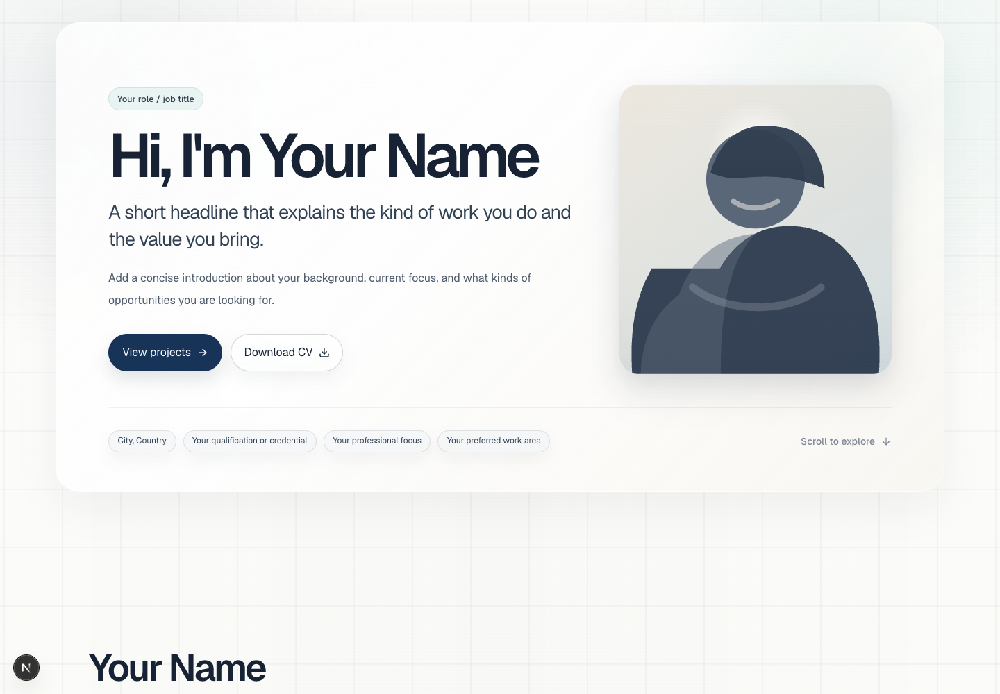
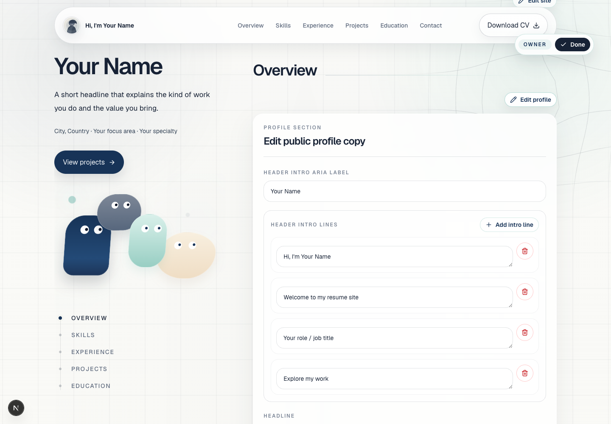

# Live Resume

[](https://vercel.com/new/clone?repository-url=https://github.com/lupanpan1030/live-resume&env=ADMIN_PASSWORD&envDescription=Admin%20password%20for%20in-page%20editing)
[Use this template](https://github.com/lupanpan1030/live-resume/generate)

A single-page Next.js resume template you can edit directly in the browser after logging in.

Created by [Ethan Chen Lu](https://ethanchenlu.com). The creator's personal site is a real portfolio example, not the default template demo.

| Resume page | In-page editor |
| --- | --- |
|  |  |

## Why Live Resume

Live Resume is a clean resume website starter for a personal profile, work history, project links, education, contact links, and a downloadable CV. It is intentionally single-language and single-page, with anchor navigation and a focused editing flow for the site owner.

Use it when you want a resume site that can be deployed quickly, customized from simple content files, and edited later without opening the codebase.

## Features

- Browser-based owner editing at `/login`
- Section editors for profile, skills, experience, projects, education, contact, and site labels
- Appearance controls for background theme and grid style
- Persistent content storage with Upstash Redis on Vercel or Redis in Docker
- Local file-system fallback for development
- Responsive single-page resume layout
- Downloadable CV link, sitemap, robots, canonical metadata, and Open Graph image
- One-click Vercel deploy and Docker self-hosting setup

## Quick Start

Install dependencies:

```bash
npm i
```

Create your local environment file:

```bash
cp .env.example .env.local
```

Set an admin password in `.env.local`:

```bash
ADMIN_PASSWORD="replace-this"
```

Start the development server:

```bash
npm run dev
```

Open `http://localhost:3000`.

Run checks:

```bash
npm run typecheck
npm run lint
npm run build
```

Run the production build locally:

```bash
npm run start
```

## Edit in the Browser

1. Visit `/login`.
2. Sign in with `ADMIN_PASSWORD`.
3. Use the owner badge in the upper-right corner to switch editing mode on.
4. Click the edit button for any section.
5. Save the inline form. The page refreshes immediately with the stored content.

Local development without Redis reads and writes `content/*.json`. Production editing should use persistent Redis storage.

## Content Model

The JSON files in `content/` are the default seed content and the local file-system fallback:

| File | Controls |
| --- | --- |
| `content/site.json` | Site name, role, location, availability, SEO text, navigation, CV link, appearance, shared UI labels |
| `content/profile.json` | Hero intro, headline, proof chips, focus items, summary, overview paragraphs |
| `content/skills.json` | Skills section title, intro, groups, and skill tags |
| `content/experience.json` | Experience section title, intro, roles, summaries, highlights, and skills |
| `content/projects.json` | Project cards, metadata, descriptions, calls to action, and external links |
| `content/education.json` | Education section title, intro, schools, degrees, periods, and details |
| `content/contact.json` | Contact section title, description, and contact links |

Keep field names stable unless you also update the matching TypeScript types, page rendering, and section editor.

## Single-Page Structure

```txt
/
  Hero
  Overview
  Skills
  Experience
  Projects
  Education
  Contact + Download CV
```

Navigation uses anchor links only:

```txt
#overview
#skills
#experience
#projects
#education
#contact
```

## Replace The CV

The download button points to:

```txt
public/cv/your-cv.pdf
```

Replace that file with your public CV PDF. Keep the same path, or update `content/site.json`:

```json
{
  "cv": {
    "label": "Download CV",
    "href": "/cv/your-cv.pdf"
  }
}
```

Do not commit private resume drafts, certificates, identity documents, or source files that should not be public.

## Project Structure

```txt
content/                    Default resume content and local write fallback
public/cv/                  Public CV download file
public/readme/              README screenshots
src/app/                    Next.js App Router pages and API routes
src/components/portfolio/   Resume UI, owner mode, and section editors
src/content/                Content types and content assembly
src/lib/auth.ts             Admin session cookie and password verification
src/lib/store.ts            Upstash, Redis, and local content stores
```

## Customization

- Replace `public/cv/your-cv.pdf` with your public CV.
- Edit content in the browser after logging in, or update the seed JSON in `content/`.
- Use the Site editor to switch the background theme and grid style.
- Replace the inline neutral SVG portrait in the portfolio components if you want a custom illustration or real portrait.
- Adjust visual styles in `src/app/globals.css` and the portfolio components.
- Set `NEXT_PUBLIC_SITE_URL` for production metadata if you know the final domain.

## Deploy

### Vercel One-Click

Use the button at the top of this README.

1. Click **Deploy with Vercel**.
2. Connect GitHub and create the project from this repository.
3. Enter `ADMIN_PASSWORD` when Vercel prompts for environment variables.
4. Deploy once.
5. Add persistent content storage through Vercel Marketplace by installing the Upstash integration for the project. It injects `UPSTASH_REDIS_REST_URL` and `UPSTASH_REDIS_REST_TOKEN`.
6. Redeploy after the Upstash variables are present.

On Vercel, production editing requires Upstash Redis. Without it, the site can render bundled default content, but edits are not backed by persistent production storage.

Set `NEXT_PUBLIC_SITE_URL` to your production URL if you want canonical URLs, sitemap, robots, and Open Graph metadata to use your domain before Vercel provides `VERCEL_URL`. Without either value, the template uses a neutral placeholder URL for metadata.

### Docker Self-Hosting

Run the app and Redis together:

```bash
ADMIN_PASSWORD="replace-this" docker compose up --build
```

The compose file sets `REDIS_URL=redis://redis:6379` for the app and stores edited content in the Redis volume. You may also set `AUTH_SECRET`:

```bash
ADMIN_PASSWORD="replace-this" AUTH_SECRET="replace-this-too" docker compose up --build
```

Production self-hosting should sit behind HTTPS, usually through a reverse proxy, because the admin session cookie is `__Host-` scoped and `secure`. Local `http://localhost:3000` is a secure browser context, so login works there for development.

### Environment Variables

| Variable | Required | Used by | Purpose |
| --- | --- | --- | --- |
| `ADMIN_PASSWORD` | Yes | Vercel, Docker | Single-admin password for `/login` and in-page editing. |
| `AUTH_SECRET` | Optional | Vercel, Docker | Explicit JWT signing secret. If omitted, the app derives a signing key from `ADMIN_PASSWORD`. |
| `UPSTASH_REDIS_REST_URL` | Required with token for persistent Vercel edits | Vercel | Upstash REST Redis URL for production content storage. |
| `UPSTASH_REDIS_REST_TOKEN` | Required with URL for persistent Vercel edits | Vercel | Upstash REST Redis token. |
| `REDIS_URL` | Set by compose | Docker | Standard TCP Redis connection string for self-hosted content storage. |
| `NEXT_PUBLIC_SITE_URL` | Optional | Vercel, Docker | Public site URL for canonical metadata, sitemap, robots, and Open Graph links. |

Content storage selection order is Upstash REST, then standard Redis, then local file system.

## Security Notes

- `ADMIN_PASSWORD` enables the single-admin `/login` flow and in-page editing.
- If `AUTH_SECRET` is omitted, the app derives the JWT signing key from `ADMIN_PASSWORD`.
- The owner session is stored in an httpOnly, `secure`, `sameSite=lax`, `__Host-` scoped cookie.
- Production self-hosting should run behind HTTPS. Local `http://localhost:3000` works for development.
- Keep `/login` out of public navigation and use a strong admin password.
- Login rate limiting is not implemented yet. Add platform-level protection or app-level rate limiting before exposing this to high-traffic or hostile environments.
- On Vercel, do not expect production editing to persist unless Upstash Redis is configured.

## Troubleshooting

| Problem | Check |
| --- | --- |
| Login fails | Make sure `ADMIN_PASSWORD` is set in the active environment and redeploy or restart the server after changing it. |
| Vercel edits do not save or disappear | Confirm `UPSTASH_REDIS_REST_URL` and `UPSTASH_REDIS_REST_TOKEN` are set, then redeploy. |
| Docker production login does not stick | Put the app behind HTTPS. `localhost` is the development exception. |
| Metadata uses a placeholder domain | Set `NEXT_PUBLIC_SITE_URL` to your production URL. |

## License

[MIT](LICENSE)
